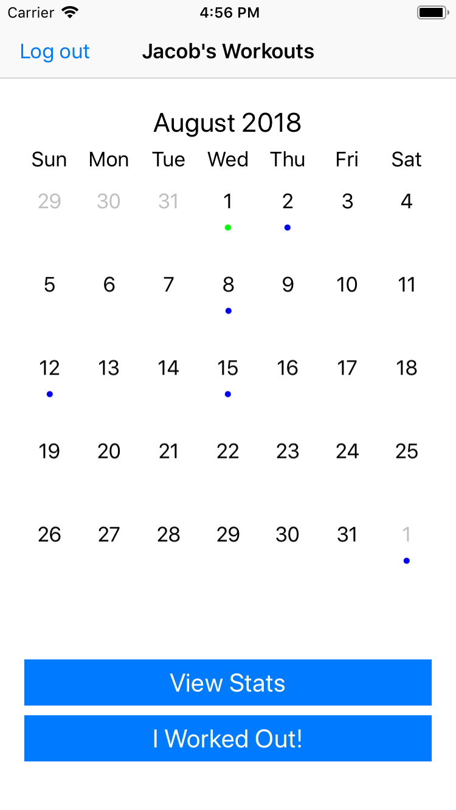

# workout-tracker
A simple iOS application that keeps track of workouts and displays information about them. The workouts are stored to a PostgreSQL database via a REST-style API written in Go and hosted on [heroku](http://workoutdb.herokuapp.com).

## Motivation
I wanted a simple way to keep track of how often I worked out, along with other information like the time of day I usually worked out at and workout frequencies over time. I also wanted to get my feet wet with iOS development.

## Features
* Create a profile to log your workouts against
* Log workouts via a stopwatch in real time as you work out, or through a pair of date pickers
* See your workouts on a calendar
* View insights on how often you work out over time and a breakdown of when in the day you work out (morning, evening, afternoon, night)
* Edit the start & end times of existing workouts, or delete them if you've added them by mistake

## Screenshots





## Running for development
#### The iOS App
You'll need to install dependencies via Cocoapods:
```
$ cd iOS
$ pod install
```
From here, the easiest way to run the app is to open the `.xcworkspace` file in Xcode and run it from there.

#### The Server
From the main directory of the repo,
```
$ go get
$ go build
$ ./workout-tracker
```
You'll need a running instance of a Postgres database with the right schema, and valid connection string in an environment variable called `DATABASE_URL`.

## Reflection & Status
I spent a lot of time working on this app that I could've used to actually work out.
With that said, I learned a lot about iOS development including [asynchronous network requests](https://medium.com/@sdrzn/networking-and-persistence-with-json-in-swift-4-c400ecab402d) in Swift, passing data between View Controllers via [delegation](https://learnappmaking.com/delegation-swift-how-to), serializing and deserializing JSON data via the [Codable](https://hackernoon.com/codable-in-swift4-e24f7cc253da) protocol in Swift 4, and integrating third party libraries to implement the
[calendar](https://github.com/patchthecode/JTAppleCalendar),
[charts](https://github.com/danielgindi/Charts), and a wrapper for the
[iOS keychain](https://github.com/jrendel/SwiftKeychainWrapper) to store user access tokens on devices.

All of the features listed above are fully implemented. There are perhaps some more interesting questions I might have about my workout habits after I collect some more data, and there are a few places I could optimize performance that I might one day get to. For now, I'm pretty happy with the app and I think I should go work out.

